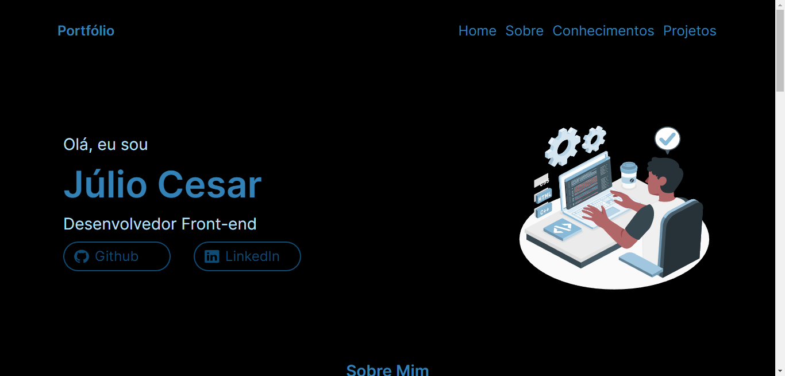

<h1 align="center">Portfólio</h1>

  <a href="#-tecnologias">Tecnologias</a>&nbsp;&nbsp;&nbsp;|&nbsp;&nbsp;&nbsp;
  <a href="#-projeto">Projeto</a>&nbsp;&nbsp;&nbsp;|&nbsp;&nbsp;&nbsp;

 

  

## 🚀 Tecnologias
Esse projeto foi desenvolvido com as seguintes tecnologias:

- HTML e CSS
- Git e Github

## 💻 Projeto

Portfólio feito com o intuito de praticar meus conhecimentos sobre criação de paginas web, e também para divulgação de meus conhecimentos em desenvolvimento front end e  divulgação de projetos futuros

link para visualização do projeto: https://jcesar03.github.io/Portfolio/
